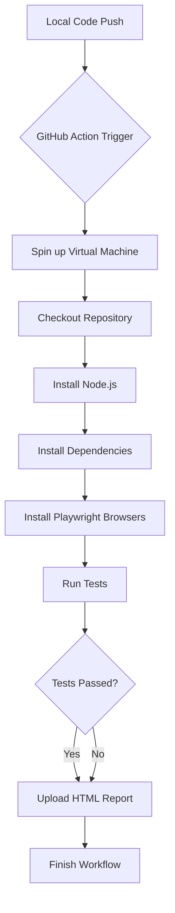

# GitHub Actions: Playwright Workflow Explained

This guide breaks down how your tests run automatically in GitHub every time you push code.

## 1. The Big Picture (Flow Diagram)

## 2. Step-by-Step Breakdown

| Step | Action | Why? |
| :--- | :--- | :--- |
| **Trigger** | `on: push` or `pull_request` | Decides *when* the tests run. |
| **Environment** | `runs-on: ubuntu-latest` | Uses a clean, Linux-based virtual machine for speed. |
| **Checkout** | `actions/checkout` | Pulls your code from GitHub into the virtual machine. |
| **Setup Node** | `actions/setup-node` | Installs the specific version of Node.js required. |
| **Install NPM** | `npm ci` | Installs all your project's libraries (Playwright, TypeScript). |
| **Install Browsers** | `npx playwright install` | Downloads the actual browser binaries (Chromium) to run tests. |
| **Run Tests** | `npx playwright test` | Executes the automation scripts. |
| **Upload Report** | `actions/upload-artifact` | Saves the HTML test report so you can download and view it later. |

## 3. Viewing Results in GitHub

1. Go to your repository on GitHub.
2. Click the **Actions** tab.
3. Select the latest workflow run.
4. If a test fails, scroll down to **Artifacts** to download the `playwright-report`.
